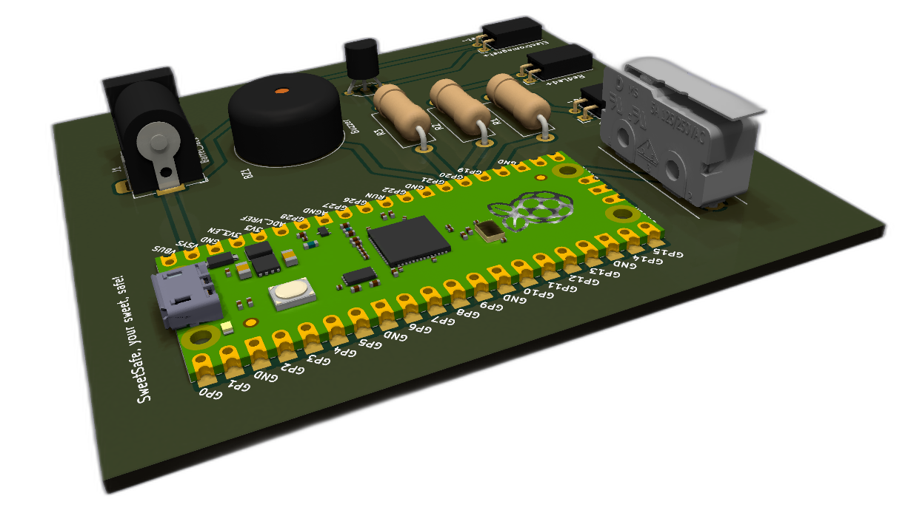
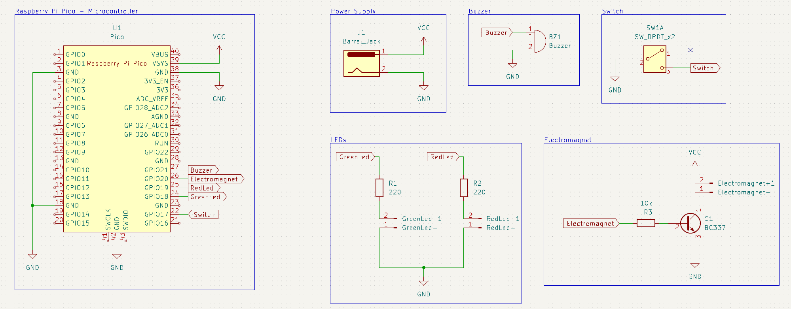
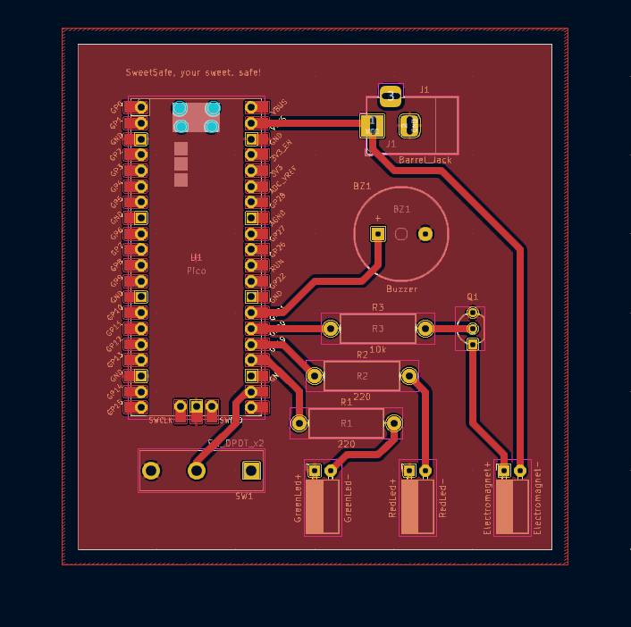
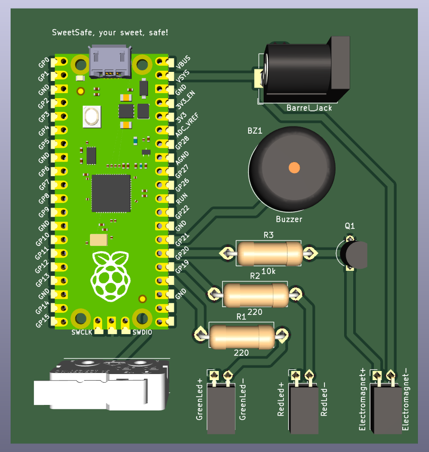
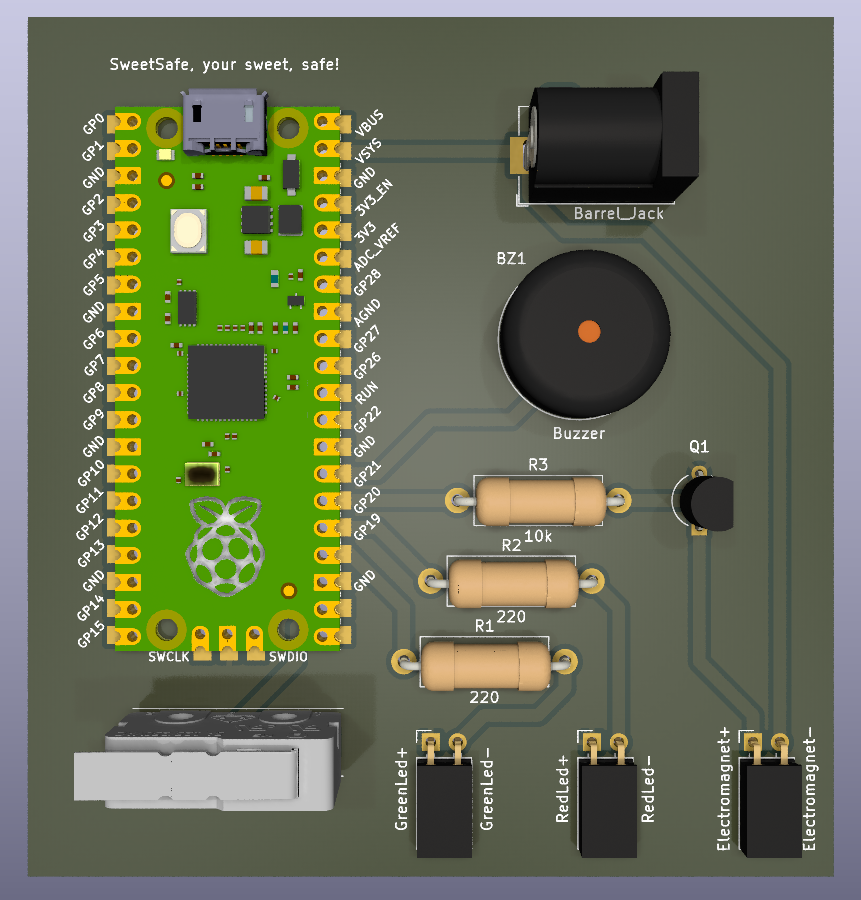

# SweetSafe

Este repositório contém os arquivos do esquemático e da PCB do projeto SweetSafe, um "cofre" de doces com Raspberry Pi Pico. Inclui uma descrição dos componentes utilizados e instruções para montagem.

O funcionamento do SweetSafe é simples: a Raspberry Pi Pico controla um eletroímã que mantém a caixa de doces fechada. Quando um pagamento é realizado com sucesso, a Raspberry Pi Pico desativa o eletroímã, permitindo que a caixa seja aberta. Neste momento, LEDs indicam visualmente que a caixa está destravada, enquanto um buzzer emite um som indicando o sucesso da transação. Caso haja uma tentativa de acesso não autorizada, um sensor de fim de curso detecta a abertura da caixa e aciona um alarme, enquanto a Raspberry Pi Pico envia uma notificação aos servidores. Assim, o SweetSafe não apenas mantém os doces seguros, mas também fornece um sistema de monitoramento eficiente para proteger seu conteúdo.

## Pastas e Arquivos

- **kicad/**: Contém os arquivos de esquemático e PCB do projeto, bem como o principal do KiCad

  - `SweetSafe.kicad_pro`: Arquivo do KiCad
  - `SweetSafe.kicad_sch`: Esquemático do projeto
  - `SweetSafe.kicad_pcb`: Layout para a PCB do projeto

- **BOM.csv**: Lista de materiais do projeto.

- **images/**: Contém as imagens do projeto

## Imagens

### Esquemático

### PCB

### Visão 3D

3D com RayTracing (porque é maneiro)

## BOM (Bill of Materials)

| Designator           | Footprint                                          | Quantity |
| -------------------- | -------------------------------------------------- | -------- |
| Switch fim de curso  | SW_MS0850502F030P1A                                | 1        |
| Resistor 220 ohms    | R_Axial_DIN0414_L11.9mm_D4.5mm_P15.24mm_Horizontal | 2        |
| Resistor 10k ohms    | R_Axial_DIN0414_L11.9mm_D4.5mm_P15.24mm_Horizontal | 1        |
| Buzzer               | Buzzer_15x7.5RM7.6                                 | 1        |
| Transistor NPN BC337 | TO-92_Inline_Wide                                  | 1        |
| Raspberry Pi Pico W  | RPi_Pico_SMD_TH                                    | 1        |
| Conector Barrel Jack | BarrelJack_Horizontal                              | 1        |
| Header Fêmea 1x02    | PinSocket_1x02_P2.54mm_Horizontal                  | 3        |

## Gerbers

Os arquivos Gerber estão disponíveis na última release e na pasta `/kicad/gerbers`
